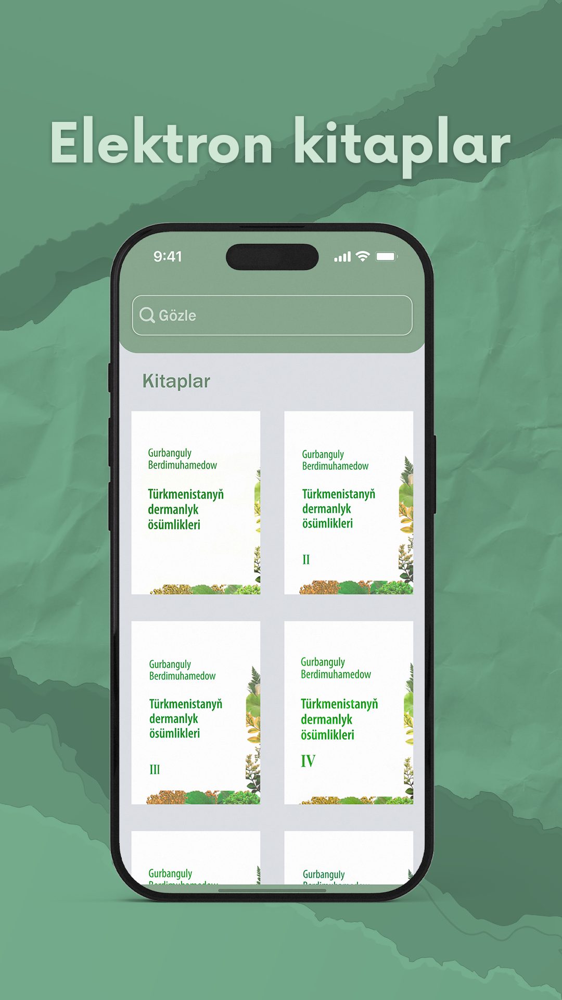

# 🌿 Türkmenistanyň Dermanlyk Ösümlikleri 📚
An **exhaustive offline compendium of herbal therapeutics**, comprising **16 volumes** of "Türkmenistanyň dermanlyk ösümlikleri". This application facilitates **multilingual exploration** in **Turkmen, English, Russian, Japanese, and Spanish**, providing both scholarly and practical insights into medicinal flora. Ideal for students, researchers, and practitioners of natural medicine.  

  
  

---

## ⚡ Features
- 🌐 **Complete offline accessibility** – uninterrupted exploration without internet  
- 🔍 **Advanced search and filtering** across all volumes  
- ✏️ **Highlighted search results** for precise referencing  
- 💾 **Bookmark and save** essential entries  
- 🌙 **Dark mode interface** for optimal ocular comfort  
- ✋ **Dynamic text resizing** via pinch gestures (plant info pages)  
- 📖 **Selectable text** for academic or personal use  
- 🗣️ **Comprehensive multilingual support:** Turkmen, English, Russian, Japanese, Spanish  
- 🧬 **Detailed phytological profiles** including scientific classification and therapeutic applications  
- 🟢 **Elegant, verdant UI** optimized for prolonged reading  
- 🤖 **AI-Driven Semantic Assistance powered by Gemini AI and Qamar AI**, enabling **context-aware clarifications**, **concise interpretations**, and **intelligent guidance** on medicinal plants
- 📷 **On-device plant recognition** using TensorFlow Lite and Google Teachable Machine

---

## 📲 Play Store
Download the app on **Google Play:**  
[Download Here](https://play.google.com/store/apps/details?id=com.medicine.kitaphana)

---

## 🛠️ Technologies Utilized
- **Android Studio** for development and compilation  
- **Java** for core application logic
- **TensorFlow Lite** for on-device plant recognition  
- **CameraX** for camera integration  
- **Gemini AI & Qamar AI** for intelligent assistant features  
- **All textual data stored in `strings.xml`** to facilitate localization and maintainability  

---

## 📝 Usage / Functional Overview
This application is meticulously designed for **middle, high school, and university students**, as well as **anyone pursuing herbal therapeutics**:  
- On launch, users encounter **16 comprehensive herbal volumes**  
- Users may **search, filter, and select** any book for detailed study  
- Each book contains **informational cards** encompassing:  
  - Plant name  
  - Comprehensive description  
  - Scientific taxonomy  
  - Medicinal applications  

💡 **Practical Applications:**  
- Academic preparation and competitions  
- Formulation of natural remedies  
- Economical alternatives to conventional pharmaceuticals  
- Guidance for caregivers seeking cost-effective medicinal solutions  

---

## 🚀 Future Enhancements / Roadmap
- 🔊 **Text-to-Speech integration** for visually impaired users  
- 🤖 **Retrieval-Augmented Generation (RAG)** for intelligent queries on plant-based remedies directly from the volumes  
- 🔬 **Expanded AI Proficiency using Gemini AI and Qamar AI**, enabling **nuanced phytological interpretations**, **evidence-based suggestions**, and **scholarly-grade reasoning** on herbal properties  

---

## 📫 Contact
**Portifolio Web Site:** <a href="https://musa-ann1.github.io/My-portifolio-webSite">Link</a>  
**Email:** musa.annaguliev@gmail.com  
**Instagram:** <a href="https://www.instagram.com/musa.annaguliev">musa.annaguliev</a>  
**Telegram:** <a href="https://t.me/Mu4asa">𝓜𝓾𝓼𝓪</a>  
**IMO:** <a href="https://s.imoim.net/spEXKo">M.</a>  

---

## 🏛️ Credits / Notes
All medicinal plant content is sourced from the **masterpiece of  
Turkmenistan's National Leader,  
Hero Arkadag,  
Gurbanguly Berdimuhamedow**.
